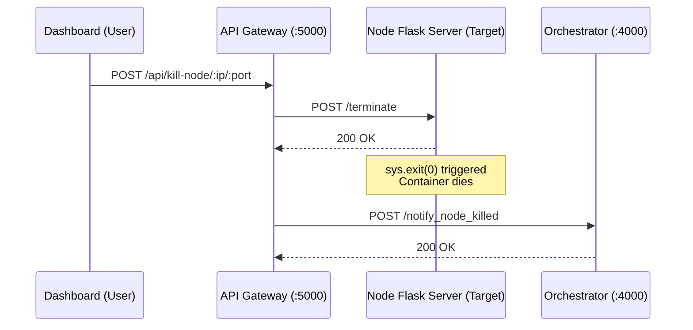

# API & Communications Reference

VOIDemon relies on a mix of REST APIs for control and configuration, peer-to-peer HTTP for gossip synchronization, and WebSockets for live telemetry streaming.

This document details the communication boundaries between the various components.

---

## 1. API Gateway (Node.js/Express)

The API Gateway runs on **Port 5000** and serves as the primary bridge between the React frontend and the Python backend simulation.

### `GET /api/config`
Retrieves the current simulation parameters by parsing `experiments/config.ini`.
- **Response:** `200 OK` (JSON representation of the INI structure)

### `POST /api/config`
Accepts a JSON payload, serializes it back to INI format, and overwrites `config.ini`.
- **Body:** `{ "VOIDemonParam": { "node_range": "[10]" ... } }`
- **Response:** `200 OK`

### `POST /api/start`
Proxies the start signal from the dashboard to the Python Orchestrator.
- **Response:** `200 OK` (Returns the orchestrator's boot confirmation)

### `POST /api/kill-node/:ip/:port`
The **Chaos Engine** endpoint. Sends a hard termination signal to a specific docker container to simulate hardware failure.
- **Parameters:** `ip` (string), `port` (string)
- **Response:** `200 OK` (Or `500 Server Error` if the node is already dead or unreachable)



### WebSockets (`Socket.IO`)
The Gateway exposes a Socket.IO server on the same port.
- **Event `run_started`**: Emitted when the orchestrator boots the cluster. Contains the initial topology list (IPs, Ports, Node IDs).
- **Event `new_metric`**: Emitted multiple times per second as nodes gossip. Contains the updated state, round number, and VoI efficiency metrics for a specific node.

---

## 2. Python Orchestrator (Flask)

The Orchestrator runs on **Port 4000**. It controls the Docker daemon and receives data from the nodes.

### `POST /start`
Reads `config.ini`, wipes the `voidemon.db` tables, spawns the Docker containers, and kicks off the simulation run.

```mermaid
sequenceDiagram
    participant O as Orchestrator
    participant D as Docker Daemon
    participant N as Gossip Nodes
    
    O->>O: Parse config.ini
