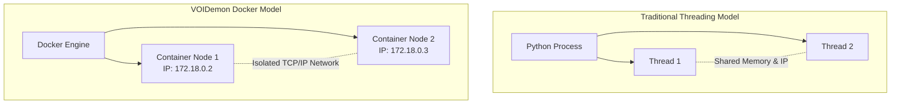

    AF[Browser Animation Frame<br/>60 FPS] -- Reads --> R
    AF -- Calls --> ST(React setState)
    ST -- Renders --> DOM[Force-Directed Graph DOM]
```

### 17. Why use JSON over REST instead of Protocol Buffers (gRPC)?
**Decision:** REST / JSON.
**Trade-off:** gRPC and Protobufs are vastly superior for inter-service communication because they send compressed binary data instead of heavy strings. However, this requires compiling `.proto` files, managing schemas, and configuring HTTP/2 support in the Python servers, significantly increasing the barrier to entry for students and researchers. JSON is human-readable, natively supported by Flask and Express, and easily visible in the Chrome Network tab. We explicitly chose developer experience (DX) and debuggability over maximum binary efficiency.

### 18. Why use HTTP POST for Chaos Engine termination instead of `docker kill`?
**Decision:** Soft-kill via Flask `/terminate`.
**Trade-off:** The Orchestrator could easily use the Docker API to run `docker stop <container>`. However, communicating with the Docker daemon takes time (sometimes 1-2 seconds), which skews the microsecond-level timing of the simulation. By exposing a `/terminate` endpoint on the Node itself that immediately triggers a `sys.exit(0)`, the node dies instantly. This accurately simulates a hard hardware crash (like a power cut) without the overhead of the Docker daemon intervening.

### 19. Why does the API Gateway proxy the React config updates to a physical `.ini` file?
**Decision:** Configuration File Persistence.
**Trade-off:** We could store the configuration purely in a database or in memory. However, researchers running this system on headless servers often prefer modifying a physical `config.ini` file via SSH and `vim`. By building a two-way sync where the React UI modifies the `.ini` file via the API Gateway, we cater to both visual users and terminal-power-users simultaneously, while keeping the configuration physically portable across environments.

### 20. Summary: The Ultimate Trade-off
Ultimately, **VOIDemon** is engineered under the philosophy that **Eventual Consistency and Developer Ergonomics are more important than Absolute Precision and Maximum Performance.** 

We trade deep JSON equality for fast Hashes. We trade synchronous DB safety for fast WAL queues. We trade absolute metric accuracy for massive battery savings via VoI. Every decision is specifically calibrated to simulate a volatile, resource-constrained edge environment as accurately and safely as possible on standard developer hardware.
# Engineering Paradigms & Implementation Trade-offs

This document serves as an exhaustive deep dive into the engineering decisions, architectural patterns, and unavoidable trade-offs made during the implementation of **VOIDemon**. 

It is structured as a Q&A designed for technical interviewers, engineering managers, and systems architects who understand distributed systems theory but need to evaluate the practical, code-level implementation choices.

---

## Part 1: Core Architecture & Frameworks

### 1. Why use Docker containers to simulate the nodes instead of just running multiple Python threads/processes on the host?
**Decision:** Full containerization via Docker.
**Trade-off:** Running lightweight Python threads or `multiprocessing` processes would consume significantly less CPU overhead and memory than booting $N$ Docker containers. However, threads share the same network interface, file system, and OS environment. By using Docker, we achieve **true network isolation**. Each node gets its own distinct IP address on the Docker bridge network. This allows the simulation to accurately replicate a physical edge deployment where network latency, dropped packets, and isolated failures occur. Docker also ensures the environment is reproducible across any developer's machine without dependency hell.



### 2. Why use Flask (a synchronous web framework) to simulate the P2P Gossip Protocol instead of FastAPI or `asyncio`?
**Decision:** Flask + multi-threading.
**Trade-off:** FastAPI or `asyncio` with `aiohttp` would allow a single Python process to handle thousands of concurrent network connections using non-blocking I/O. However, in our architecture, *each node* is isolated in its own Docker container. A single node rarely handles more than 3-5 concurrent peer connections during a gossip tick (defined by the fan-out rate $k=3$). Flask’s simple, synchronous threaded model is more than sufficient for this low-concurrency threshold per-container. It vastly simplifies the mental model of the codebase by avoiding `async/await` colored functions, making the core gossip logic easier for researchers and new contributors to read and modify.

### 3. Why introduce a Node.js/Express API Gateway instead of serving the React app directly from the Python Orchestrator?
**Decision:** Decoupled Node.js API Gateway.
**Trade-off:** We could have served the React static files and WebSocket connections directly from the Flask Orchestrator. However, Python (and specifically Flask-SocketIO) notoriously struggles with high-throughput, low-latency WebSocket streaming due to the Global Interpreter Lock (GIL) and event-loop mismatches. By introducing Node.js, we leverage the V8 engine's asynchronous I/O superiority. The Python Orchestrator purely handles heavy data processing and SQLite writes, then pushes a single HTTP payload to Node.js, which flawlessly fans it out to hundreds of connected UI clients via Socket.IO without dropping frames.

### 4. Why use React with Vite and Tailwind instead of a lighter vanilla JS implementation?
**Decision:** React + Vite.
**Trade-off:** A vanilla JS implementation with D3.js would result in a smaller bundle size. However, maintaining complex, rapidly updating state (like a live force-directed graph tracking 50 nodes and 200 edges) becomes a DOM-manipulation nightmare in vanilla JS. React’s declarative state model, combined with Vite’s near-instant HMR (Hot Module Replacement), dramatically accelerated development. Tailwind CSS allowed for rapid prototyping of a complex, dark-mode dashboard without maintaining massive stylesheets.

---

## Part 2: Distributed Systems Patterns

### 5. Why utilize the Singleton Pattern for the `Node` state in Python?
**Decision:** `Singleton` decorator for the core `Node` class.
**Trade-off:** Singletons are often considered anti-patterns because they introduce global state and make unit testing difficult. However, in our specific Dockerized architecture, each container represents exactly *one* physical node. The Flask HTTP server (which receives incoming gossip) and the background daemon thread (which initiates outgoing gossip) both need read/write access to the exact same peer tracking database and metric state. Passing a shared instance around Flask's request context is unnecessarily complex. The Singleton pattern guarantees that no matter where the `Node` is imported within that specific container, both threads operate on the exact same memory space.

### 6. Why use a Push-Pull Gossip Protocol variant instead of Push-only or Pull-only?
**Decision:** Push-Pull.
**Trade-off:** 
- *Push-only* is fast but causes massive redundant network traffic because nodes blindly broadcast state to peers who might already have it.
- *Pull-only* minimizes traffic but introduces high latency, as nodes must first query for updates, then request them.
- *Push-Pull* requires slightly more complex metadata exchange. The initiator sends a small metadata vector (version counters). The receiver calculates the delta, *pulls* what it lacks, and *pushes* what the initiator lacks in a single round-trip. This perfectly balances network efficiency with rapid convergence.

