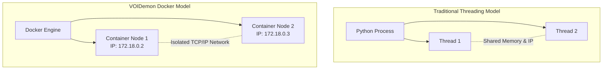
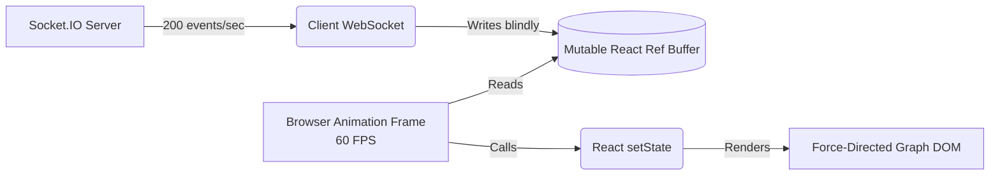

# Engineering Paradigms & Implementation Trade-offs

This document serves as an exhaustive deep dive into the engineering decisions, architectural patterns, and unavoidable trade-offs made during the implementation of **VOIDemon**. 

It is structured as a Q&A designed for technical interviewers, engineering managers, and systems architects who understand distributed systems theory but need to evaluate the practical, code-level implementation choices.

---

## Part 1: Core Architecture & Frameworks

### 1. Why use Docker containers to simulate the nodes instead of just running multiple Python threads/processes on the host?
**Decision:** Full containerization via Docker.
**Trade-off:** Running lightweight Python threads or `multiprocessing` processes would consume significantly less CPU overhead and memory than booting $N$ Docker containers. However, threads share the same network interface, file system, and OS environment. By using Docker, we achieve **true network isolation**. Each node gets its own distinct IP address on the Docker bridge network. This allows the simulation to accurately replicate a physical edge deployment where network latency, dropped packets, and isolated failures occur. Docker also ensures the environment is reproducible across any developer's machine without dependency hell.

### 2. Why use Flask (a synchronous web framework) to simulate the P2P Gossip Protocol instead of FastAPI or `asyncio`?
**Decision:** Flask + multi-threading.
**Trade-off:** FastAPI or `asyncio` with `aiohttp` would allow a single Python process to handle thousands of concurrent network connections using non-blocking I/O. However, in our architecture, *each node* is isolated in its own Docker container. A single node rarely handles more than 3-5 concurrent peer connections during a gossip tick (defined by the fan-out rate $k=3$). Flask’s simple, synchronous threaded model is more than sufficient for this low-concurrency threshold per-container. It vastly simplifies the mental model of the codebase by avoiding `async/await` colored functions, making the core gossip logic easier for researchers and new contributors to read and modify.

### 3. Why introduce a Node.js/Express API Gateway instead of serving the React app directly from the Python Orchestrator?
**Decision:** Decoupled Node.js API Gateway.
**Trade-off:** We could have served the React static files and WebSocket connections directly from the Flask Orchestrator. However, Python (and specifically Flask-SocketIO) notoriously struggles with high-throughput, low-latency WebSocket streaming due to the Global Interpreter Lock (GIL) and event-loop mismatches. By introducing Node.js, we leverage the V8 engine's asynchronous I/O superiority. The Python Orchestrator purely handles heavy data processing and SQLite writes, then pushes a single HTTP payload to Node.js, which flawlessly fans it out to hundreds of connected UI clients via Socket.IO without dropping frames.

### 4. Why use React with Vite and Tailwind instead of a lighter vanilla JS implementation?
**Decision:** React + Vite.
**Trade-off:** A vanilla JS implementation with D3.js would result in a smaller bundle size. However, maintaining complex, rapidly updating state (like a live force-directed graph tracking 50 nodes and 200 edges) becomes a DOM-manipulation nightmare in vanilla JS. React’s declarative state model, combined with Vite’s near-instant HMR (Hot Module Replacement), dramatically accelerated development. Tailwind CSS allowed for rapid prototyping of a complex, dark-mode dashboard without maintaining massive stylesheets.

---

## Part 2: Distributed Systems Patterns

### 5. Why utilize the Singleton Pattern for the `Node` state in Python?
**Decision:** `Singleton` decorator for the core `Node` class.
**Trade-off:** Singletons are often considered anti-patterns because they introduce global state and make unit testing difficult. However, in our specific Dockerized architecture, each container represents exactly *one* physical node. The Flask HTTP server (which receives incoming gossip) and the background daemon thread (which initiates outgoing gossip) both need read/write access to the exact same peer tracking database and metric state. Passing a shared instance around Flask's request context is unnecessarily complex. The Singleton pattern guarantees that no matter where the `Node` is imported within that specific container, both threads operate on the exact same memory space.

### 6. Why use a Push-Pull Gossip Protocol variant instead of Push-only or Pull-only?
**Decision:** Push-Pull.
**Trade-off:** 
- *Push-only* is fast but causes massive redundant network traffic because nodes blindly broadcast state to peers who might already have it.
- *Pull-only* minimizes traffic but introduces high latency, as nodes must first query for updates, then request them.
- *Push-Pull* requires slightly more complex metadata exchange. The initiator sends a small metadata vector (version counters). The receiver calculates the delta, *pulls* what it lacks, and *pushes* what the initiator lacks in a single round-trip. This perfectly balances network efficiency with rapid convergence.

### 7. Why use SHA-256 Digests to compare states instead of deep JSON equality checks?
**Decision:** Cryptographic Hashing for state comparison.
**Trade-off:** Hashing consumes CPU cycles. However, doing a recursive, deep-key comparison of two large JSON metric objects in Python is extremely slow and memory-intensive. By calculating a SHA-256 digest of the metric state and exchanging only the hash during the metadata phase, nodes can determine if their states differ in $O(1)$ time complexity. This trades a negligible amount of CPU time for a massive gain in speed and network bandwidth.

### 8. Why implement Leaderless Quorum Consensus (LQC) instead of Raft or Paxos for fault detection?
**Decision:** LQC (3-Strike rule).
**Trade-off:** Raft and Paxos provide strong consistency and guarantee a single source of truth via leader election. However, edge environments are volatile; leaders die frequently, triggering expensive re-election storms that halt the system. LQC embraces eventual consistency. There is no leader. If Node A detects Node B is dead, it marks it as `Suspect`. Only when the gossip network converges and a mathematical quorum ($N/2 + 1$) agrees the timestamp is stale does the cluster formally consider the node dead. This trades absolute microsecond consistency for massive fault tolerance and zero network blocking.

### 9. Why use physical timestamps for liveness instead of Logical Clocks (Lamport/Vector Clocks)?
**Decision:** System time timestamps.
**Trade-off:** In distributed systems, relying on physical clocks is dangerous due to clock drift across servers. Vector clocks perfectly order events causally. However, vector clocks grow linearly with the number of nodes $O(N)$, creating massive overhead in a 1,000-node cluster. Because VOIDemon nodes are simulated on the same physical host (or within NTP-synchronized edge clusters), clock drift is negligible. Using a simple timestamp for the heartbeat ($H_i(t)$) keeps the payload tiny ($O(1)$) while effectively detecting stale connections.

---

## Part 3: Value of Information (VoI) Filtering

### 10. Why use static priority tiers (HIGH, MEDIUM, LOW) instead of a dynamic Machine Learning model for VoI?
**Decision:** Heuristic Thresholds ($\Delta$ logic).
**Trade-off:** An ML model could theoretically adapt to network conditions and predict which metrics are most valuable. However, running inference models on resource-constrained edge devices (like a Raspberry Pi) drains the exact battery life we are trying to save. Static heuristic tiers (e.g., CPU = HIGH, Storage = LOW) combined with simple $\Delta$ (delta percentage change) math execute in microseconds, requiring virtually zero CPU overhead while still achieving 60%+ bandwidth savings.

### 11. Doesn't filtering metrics (VoI) violate the concept of "Eventual Consistency"?
**Decision:** Intentional Stale State.
**Trade-off:** Yes, technically. If the Storage metric doesn't change by more than 5%, the VoI engine suppresses it. Therefore, peer nodes will hold a slightly outdated Storage value for that node indefinitely. We explicitly trade *absolute data accuracy* for *network survival*. In edge monitoring, knowing that a node's storage went from 45.1% to 45.2% has zero operational value, but transmitting that change costs battery. The VoI engine guarantees that *operationally significant* data is strictly consistent, while static data is allowed to drift within safe, defined tolerances.

---

## Part 4: Database & Orchestration

### 12. Why use SQLite in WAL mode instead of PostgreSQL, Redis, or Time-Series databases (InfluxDB)?
**Decision:** SQLite with Write-Ahead Logging (WAL).
**Trade-off:** PostgreSQL or InfluxDB are industry standards for time-series telemetry. However, VOIDemon is a portable simulation framework. Requiring users to spin up and configure a heavy PostgreSQL cluster just to run a test creates massive friction. SQLite is serverless and embedded in the Python standard library. 
The standard SQLite database locks the entire file during writes, which would instantly bottleneck our 50-node simulation. By enabling `PRAGMA journal_mode=WAL`, readers and writers can operate concurrently. We trade the robust clustering of Postgres for absolute portability, while WAL mode ensures our high-frequency write batches don't lock up the system.

### 13. Why use a background Thread & Queue for Database Inserts in the Orchestrator?
**Decision:** Asynchronous Database Worker Thread.
**Trade-off:** When 50 nodes hit the Orchestrator's `/receive_node_data` endpoint simultaneously, opening 50 concurrent SQLite connections would cause disk I/O thrashing and `database is locked` errors, even with WAL mode. Instead, the Flask endpoints simply drop the JSON payload into an in-memory `queue.Queue`. A dedicated background thread pops payloads in batches of 50 and executes a single bulk SQL `executemany` transaction. We trade real-time persistence (data might sit in memory for 100ms) for a massive increase in throughput and disk safety.

### 14. Why set SQLite `synchronous = NORMAL` instead of `FULL`?
**Decision:** Reduced fsync() calls.
**Trade-off:** `FULL` synchronous mode guarantees that if the host machine loses power entirely, the database will not corrupt. However, calling `fsync()` on the SSD 1,000 times a second during a simulation destroys disk write speeds and degrades the physical hardware. `NORMAL` delegates the sync to the OS, vastly improving write speeds. Because this is a simulation and metrics are ephemeral, we accept the incredibly small risk of data loss on power failure to save the user's SSD hardware.

### 15. Why decouple the Orchestrator from the Gossip Network?
**Decision:** God-view Orchestrator.
**Trade-off:** We could have made the Orchestrator just another node in the gossip network to collect data. However, making it a peer would influence the stochastic nature of the network (nodes would route through it preferentially). By keeping it isolated, the 10 Docker nodes gossip blindly amongst themselves exactly as they would in the wild. They push data to the Orchestrator out-of-band via a separate HTTP call strictly for analytics and graphing, ensuring the experimental data is not contaminated by observer interference.

---

## Part 5: UI & Frontend Optimization

### 16. Why use `requestAnimationFrame` (RAF) batching instead of standard React `setState` for Socket.IO messages?
**Decision:** RAF Buffer.
**Trade-off:** When 50 nodes are gossiping, the Node.js server might emit 100 WebSocket events per second to the React client. If we call `setState()` 100 times a second, React's virtual DOM reconciliation will freeze the browser tab entirely (Layout Thrashing).
We could use `lodash.throttle`, but that arbitrarily drops data. Instead, we write incoming socket data into a mutable JavaScript Ref object. We then hook into the browser's native `requestAnimationFrame` API to read that object and call `setState` exactly once per monitor refresh rate (typically 60fps). This trades microscopic data immediacy for a buttery-smooth 60fps UI that never drops a frame, regardless of network load.

### 17. Why use JSON over REST instead of Protocol Buffers (gRPC)?
**Decision:** REST / JSON.
**Trade-off:** gRPC and Protobufs are vastly superior for inter-service communication because they send compressed binary data instead of heavy strings. However, this requires compiling `.proto` files, managing schemas, and configuring HTTP/2 support in the Python servers, significantly increasing the barrier to entry for students and researchers. JSON is human-readable, natively supported by Flask and Express, and easily visible in the Chrome Network tab. We explicitly chose developer experience (DX) and debuggability over maximum binary efficiency.

### 18. Why use HTTP POST for Chaos Engine termination instead of `docker kill`?
**Decision:** Soft-kill via Flask `/terminate`.
**Trade-off:** The Orchestrator could easily use the Docker API to run `docker stop <container>`. However, communicating with the Docker daemon takes time (sometimes 1-2 seconds), which skews the microsecond-level timing of the simulation. By exposing a `/terminate` endpoint on the Node itself that immediately triggers a `sys.exit(0)`, the node dies instantly. This accurately simulates a hard hardware crash (like a power cut) without the overhead of the Docker daemon intervening.

### 19. Why does the API Gateway proxy the React config updates to a physical `.ini` file?
**Decision:** Configuration File Persistence.
**Trade-off:** We could store the configuration purely in a database or in memory. However, researchers running this system on headless servers often prefer modifying a physical `config.ini` file via SSH and `vim`. By building a two-way sync where the React UI modifies the `.ini` file via the API Gateway, we cater to both visual users and terminal-power-users simultaneously, while keeping the configuration physically portable across environments.

### 20. Summary: The Ultimate Trade-off
Ultimately, **VOIDemon** is engineered under the philosophy that **Eventual Consistency and Developer Ergonomics are more important than Absolute Precision and Maximum Performance.** 

We trade deep JSON equality for fast Hashes. We trade synchronous DB safety for fast WAL queues. We trade absolute metric accuracy for massive battery savings via VoI. Every decision is specifically calibrated to simulate a volatile, resource-constrained edge environment as accurately and safely as possible on standard developer hardware.
