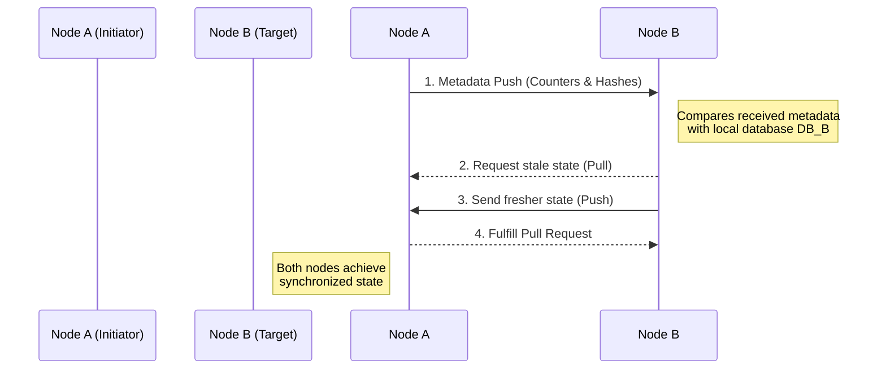
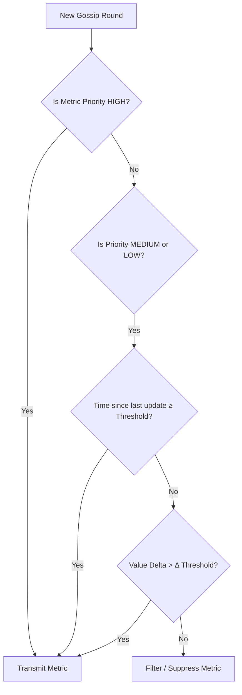

# Theoretical Foundations & Concepts

This document outlines the core theories, algorithmic models, and conceptual paradigms that drive the **VOIDemon** decentralized monitoring framework. 

---

## 1. The Challenge of Edge Computing Monitoring

The proliferation of the Internet of Things (IoT) has driven the adoption of edge computing—a paradigm essential for processing data near its source to meet the demands of latency-sensitive applications. However, edge environments are characterized by extreme volatility, resource constraints, and device heterogeneity.

### 1.1 The Centralized Bottleneck
Traditional monitoring systems rely on centralized architectures (e.g., a central Prometheus or Datadog server polling nodes). This is fundamentally ill-suited for the edge:
- **Single Point of Failure:** If the central server or the connection to it drops, monitoring is completely blinded.
- **Network Latency & Jitter:** Polling thousands of edge devices creates massive network spikes.
- **Resource Drain:** Edge nodes, often running on battery power and limited bandwidth, cannot afford constant, heavy network transmissions.

VOIDemon introduces a paradigm shift towards **decentralized monitoring**, distributing the responsibility among all participating nodes via peer-to-peer protocols.

---

## 2. Stochastic Gossip Protocols

To achieve true decentralization, VOIDemon leverages a **Stochastic Gossip (or Epidemic) Protocol**. This ensures eventual consistency across the network without relying on a central coordinator.

### 2.1 The Push-Pull Variant
VOIDemon implements a highly efficient push-pull gossip variant. In each discrete time step (gossip round $t$), a node $n_i$ selects a random peer $n_j$ and initiates a synchronization cycle:

This bidirectional exchange in a single round-trip ensures rapid and efficient synchronization. The state of node $n_i$ at time $t$ is encapsulated in a formal data tuple:

$$ S_i(t) = \{ M_i(t), C_i(t), H_i(t), D_i(t) \} $$

Where:
- **$M_i(t)$:** Vector of $Z$ system metrics (CPU, Memory, etc.).
- **$C_i(t)$:** A monotonically increasing integer counter (version number).
- **$H_i(t)$:** A timestamp for liveness detection (heartbeat).
- **$D_i(t)$:** A cryptographic hash (SHA-256) of the metric vector $M_i(t)$ to quickly determine staleness without deeply comparing payload contents.

---

## 3. Value of Information (VoI) Priority Filtering

The standard gossip protocol is incredibly robust but prohibitively resource-intensive. Disseminating a node's complete state in every cycle leads to transmitting redundant information, draining battery life and clogging bandwidth.

VOIDemon's core innovation is the **Value of Information (VoI)** metric filtering system.

### 3.1 Tiered Priority Logic
Metrics are assigned to priority tiers based on operational criticality and expected volatility:
- **HIGH Priority (e.g., CPU):** Critical for real-time visibility. Always transmitted.
- **MEDIUM Priority (e.g., Network I/O):** Transmitted only if the change exceeds a specific delta ($\Delta$) threshold, or a specific time interval has passed.
- **LOW Priority (e.g., Storage Capacity):** Rarely changes. Heavily filtered and updated infrequently.

### 3.2 Formal Transmission Decision
The decision to transmit a specific metric $m$ is governed by a boolean function $T(m, i, t)$:

$$
T(m, i, t) = \begin{cases} 
1, & \text{if } P(m) = \text{HIGH} \\
1, & \text{if } P(m) \in \{\text{MED, LOW}\} \land (t - t_{last} \geq k_p \lor |v_i(t) - v_{last}| > \Delta_p) \\
0, & \text{otherwise} 
\end{cases}
$$

The final transmitted metric vector is the filtered subset: 
$$ M'_i(t) = \{ m \in M_i(t) \mid T(m, i, t) = 1 \} $$

---

## 4. Bandwidth and Energy Conservation Models

The application of VoI filtering translates into mathematically provable and empirically validated savings in both bandwidth and energy.

### 4.1 Bandwidth Savings ($S_B$)
In a standard baseline gossip protocol over $T$ rounds across $K$ nodes with a metric vector cardinality $Z$, the total potential transmissions are:
$$ B_{total} = T \cdot K \cdot Z $$

With VoI filtering, the actual transmissions are the sum of the transmission decisions:
$$ B_{VoI} = \sum_{t=1}^{T} \sum_{i=1}^{K} \sum_{z=1}^{Z} T(m_z, i, t) $$

The percentage of bandwidth saved is therefore:
$$ S_B(\%) = \left( 1 - \frac{B_{VoI}}{B_{total}} \right) \times 100 $$

Empirical evaluations in VOIDemon consistently demonstrate an $S_B$ of **50% to 75%**, reducing 600,000 baseline transmissions to roughly 310,000 for a 10-node cluster over standard observation windows.

### 4.2 Battery Life Extension
Assuming the energy cost to transmit a single metric update ($\epsilon_m$) is constant, the total energy saved ($E_{saved}$) is directly proportional to the suppressed transmissions:

$$ E_{saved} = \epsilon_m \cdot (B_{total} - B_{VoI}) $$
